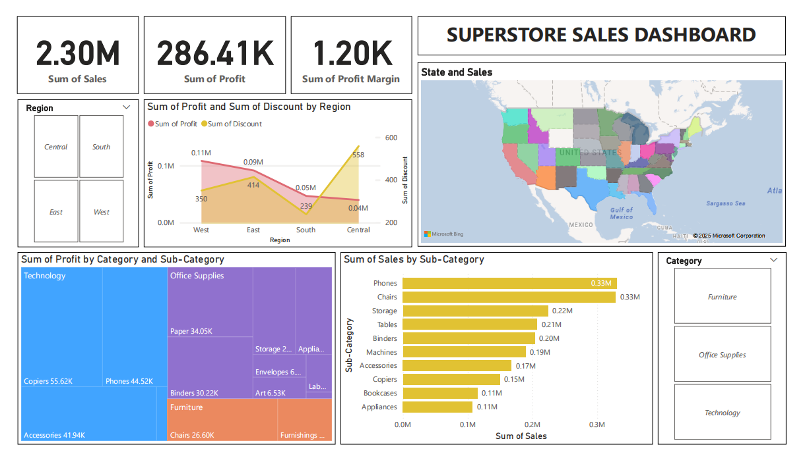

# 📊 Supermarket Sales Dashboard using Power BI

An interactive dashboard project analyzing sales, profit, and discount trends from a retail superstore dataset. Built entirely in Power BI using the “Sample - Superstore” Excel dataset.


## 📁 Dataset

- `Sample - Superstore.xlsx`  – A retail dataset containing 9994 rows with sales, profit, discount, region, state, and product category details.
- `supermarket-sales.pdf` – Exported dashboard view  
- `supermarket-sales.pbix` – Power BI source file 


## 📌 Features

- Total Sales, Profit & Profit Margin KPIs  
- Interactive Region & Category Slicers  
- Sales by Sub-Category (bar chart)  
- Profit by Category & Sub-Category (treemap)  
- State-wise Sales Analysis (filled map)  
- Regional Profit vs. Discount Trends (line & area chart)  
- Fully interactive and cross-filterable visuals


## 📷 Dashboard Preview




## 🚀 Insights

- Phones & Chairs are top sub-categories in sales.  
- Technology leads in profitability.  
- Central region offers high discounts but lower profits.  
- Region-wise discounting affects margin.  
- Some states show high sales but negative profit.


## 🛠️ Tools Used

| Tool              | Purpose                                |
|------------------|----------------------------------------|
| Power BI Desktop | Data modeling and dashboard building   |
| Microsoft Excel  | Data preparation and cleanup           |


## 📈 Use Cases

- Regional sales planning  
- Category-wise performance tracking  
- Discount impact analysis  
- State-wise inventory forecasting  


## 🗂️ Project Structure

```bash
📁 Supermarket-sales-report
├── Sample - Superstore.xlsx
├── supermarket-sales.pbix
├── supermarket-sales.pdf
├── case_study.pdf
├── assets/
│   └── superstore-dashboard.png
└── README.md
```


## 📝 Full Case Study

This project includes a detailed case study covering:

- Executive Summary
- Problem Statement & Objective
- Dataset Description
- Metrics Summary
- Tools & Features
- Key Insights & Business Impact
- Outcome & Future Enhancements

📄 [Download Case Study (PDF)](./case_study.pdf)


## 📬 Contact

Connect with me on [LinkedIn](https://www.linkedin.com/in/ardhigagan)  
GitHub: [@ardhigagan](https://github.com/ardhigagan)
